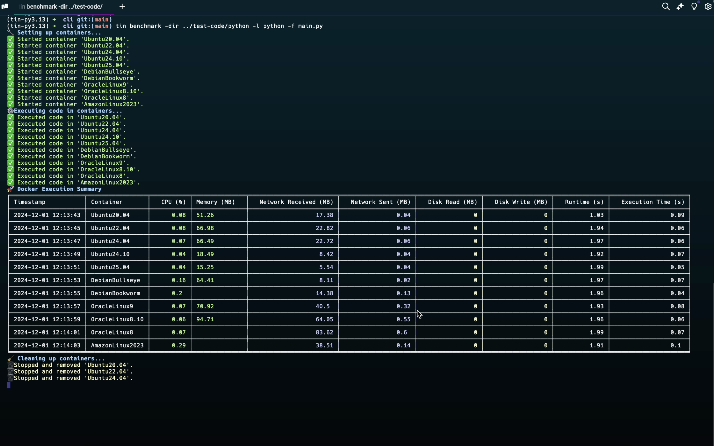

# tin

 

**Tin** is a light-weight, easy to use command line tool and GUI for developers.

It allows devs to benchmark their project across a number of different distros and systems to compare factors including completion time, CPU usage, memory usage, network statistics, and more.

For more information, check out our [DoraHacks Page](https://dorahacks.io/buidl/20363) or watch our [YouTube Demo](https://www.youtube.com/watch?v=EIqeNASTFvg).

## 💻 CLI Tool

## 🌐 Web UI

## 📚 Resources

- [Typer CLI](https://typer.tiangolo.com)
- [Docker Python Library](https://pypi.org/project/docker/)
- [Dockerhub](https://hub.docker.com)
- [Docker](https://www.docker.com/)
- [FastAPI](https://fastapi.tiangolo.com/)
- [Next.js](https://nextjs.org/)
- [Tabulate](https://pypi.org/project/tabulate/)
- [ChatGPT API](https://platform.openai.com/docs/guides/chat)
- [Pandas](https://pandas.pydata.org/)
- [shadcn](https://shadcn.dev/)
- [Tailwind CSS](https://tailwindcss.com/)
- [Tempo Labs](https://www.tempolabs.com/)
- [Warp](https://www.warp.dev/)

## ✍️ Authors

- [Aryan Khurana](https://github.com/AryanK1511)
- [Katarina Vucic](https://github.com/katarinaavucic)
- [Manav Sharma](https://github.com/themanavsharma)
- [Tyler Steptoe](https://github.com/ddynamix)
